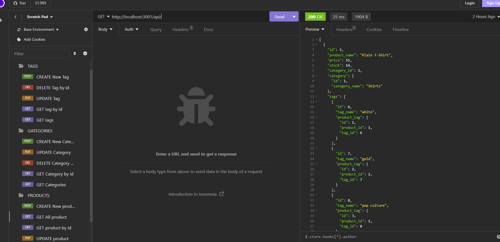
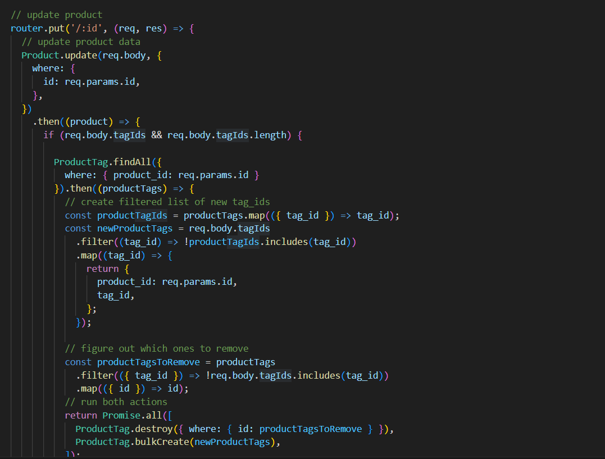
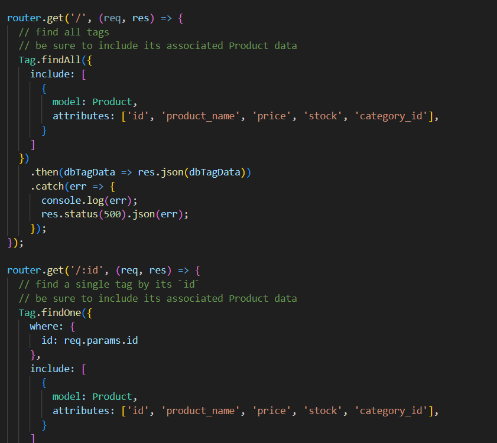
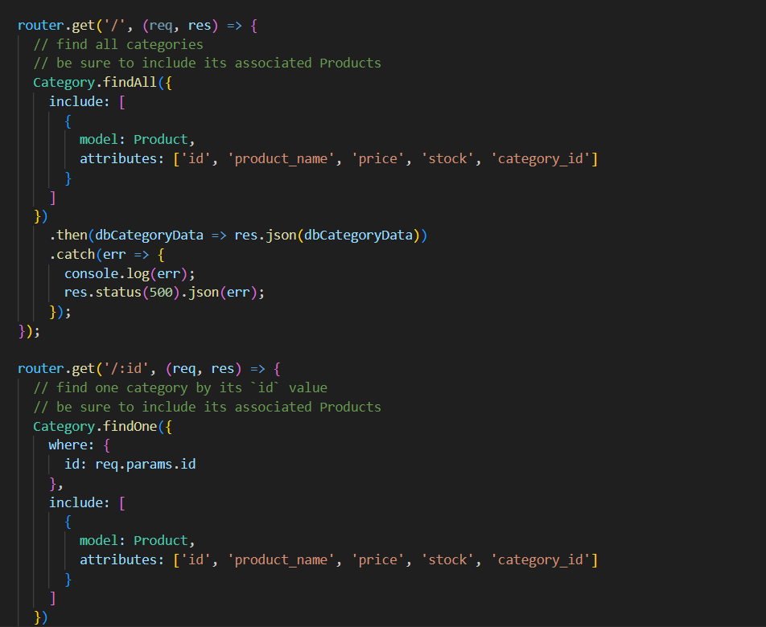

# E-commerce Back End Starter Code

## Table of Contents (Optional)

- [Description](#description)
- [Installation](#installation)
- [Usage](#usage)
- [Credits](#credits)
- [License](#license)

## Description

I learn SQL Database Using ORM and how to connect between SQL and server and learn save SQL username and password in .env file ,I build this project to build more organized database and easy to create ,view and update. 

- What problem does it solve?
1- add my database name, MySQL username, and MySQL password to an environment variable file (.env) to connect to SQL database using Sequelize.
2- run SQL database to create tables and data using schema and seed commands.
3- when run the project using "mpn run start" then can open Insomnia.
4- when open Insomnia will displayed three folders (categories, products, and tags)
5- each folder has a test API (data GET ,POST, PUT, and DELETE) so data can (View ,create, update, and delete from database)

## Installation

The project has many installation process for (package.json) and it's install using this command in terminal "npm init", install express server using (npm install express) or (npm i) , install sequelize (npm install sequelize), install mysql2 using (npm install mysql2) and install .env file to save (database name ,username,password) for SQL database login using (npm install dotenv)

## Usage
After install all packages , run the project using "npm run start" , then open Insomnia

github :  https://github.com/omeraus6/ECommerceBackEnd

image 1: project in Insomnia

image 2: 

image 3: 

image 4: image 2-4: project code

video 1: project video run

## Credits

Thank you for tips and sugestion from Bootcamp instructors and classmates, I hava used https://developer.mozilla.org/en-US/docs/Web/CSS/grid-template to reserch information.

## License

Please refer to the LICENSE in the repo.